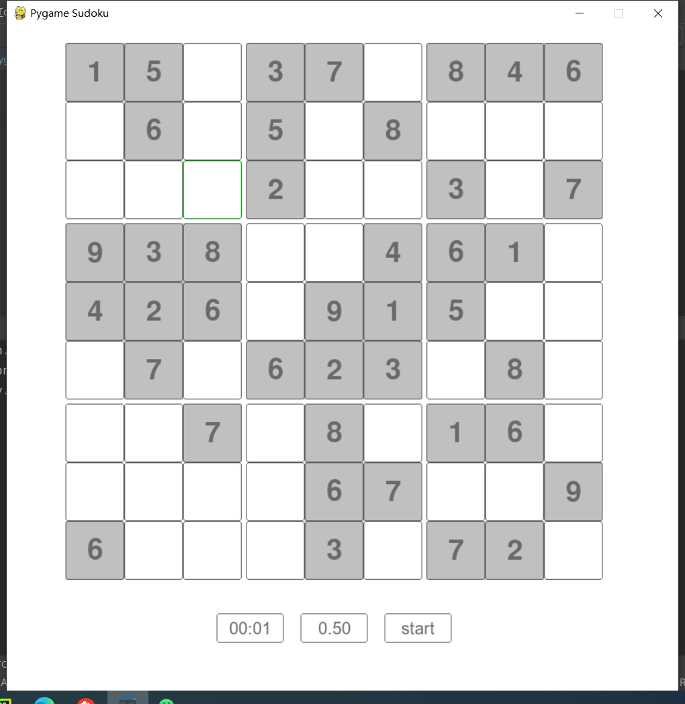

# pyg-sudoku

A simple python-sudoku game via [py-sudoku](https://github.com/jeffsieu/py-sudoku) and pygame

### package
```shell
 Pyinstaller -Fw -i grid.ico  --upx-dir={dir} -n Sudoku pyg_sudoku.py
```

### screenshot

The three boxes at the bottom are:

1. timer clock
2. difficulty box by rolling the mouse wheel
3. start button


